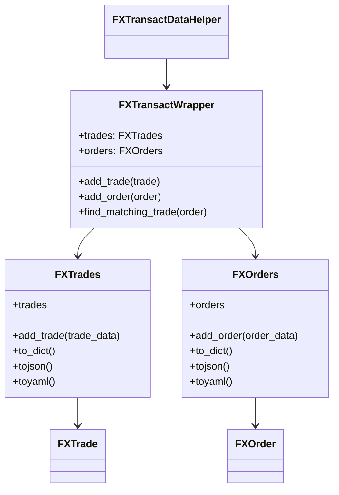

# Class Diagrams

```mermaid
classDiagram
    class FXTrade
    class FXOrder
    class FXTrades {
        +trades
        +add_trade(trade_data)
        +to_dict()
        +tojson()
        +toyaml()
    }
    class FXOrders {
        +orders
        +add_order(order_data)
        +to_dict()
        +tojson()
        +toyaml()
    }
    class FXTransactWrapper {
        +trades: FXTrades
        +orders: FXOrders
        +add_trade(trade)
        +add_order(order)
        +find_matching_trade(order)
    }
    class FXTransactDataHelper
    FXTrades --> FXTrade
    FXOrders --> FXOrder
    FXTransactWrapper --> FXTrades
    FXTransactWrapper --> FXOrders
    FXTransactDataHelper --> FXTransactWrapper
```

These classes live in `jgtutils/FXTransact.py` and handle trade and order data, saving and loading them as JSON or YAML.
