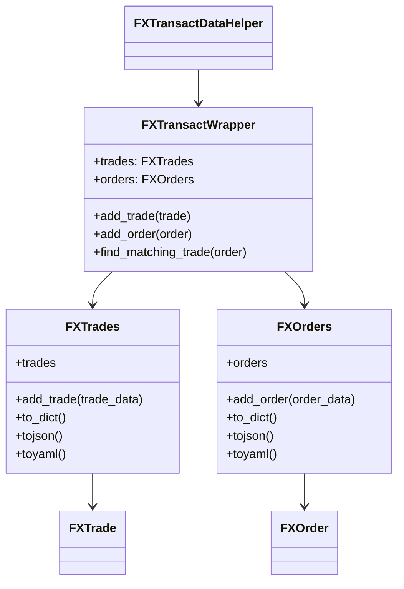
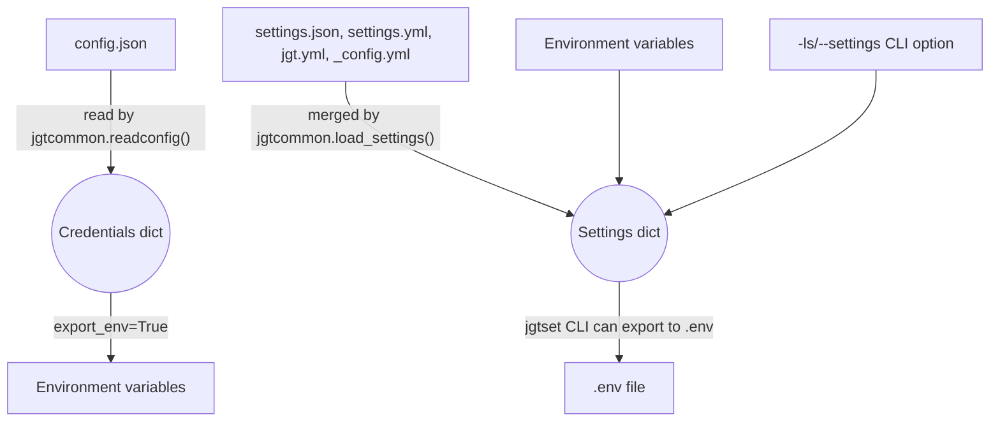

# Class Diagrams

These classes live in `jgtutils/FXTransact.py` and handle trade and order data, saving and loading them as JSON or YAML.

---

## Configuration Flow

- `config.json` is loaded in a specific order (see CONFIGURATION.md).
- `settings.json` and related files are merged, with later sources overriding earlier ones.
- Both can be exported to environment variables for use in scripts or shells.
